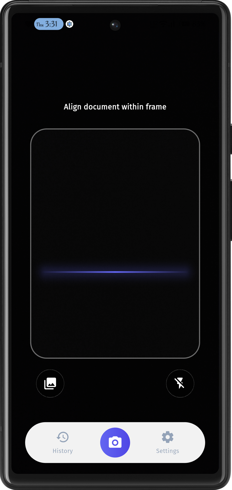
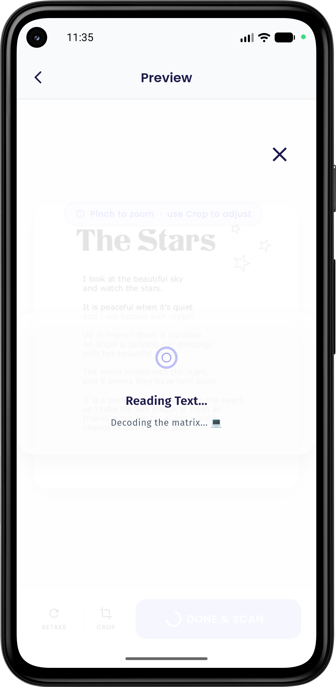
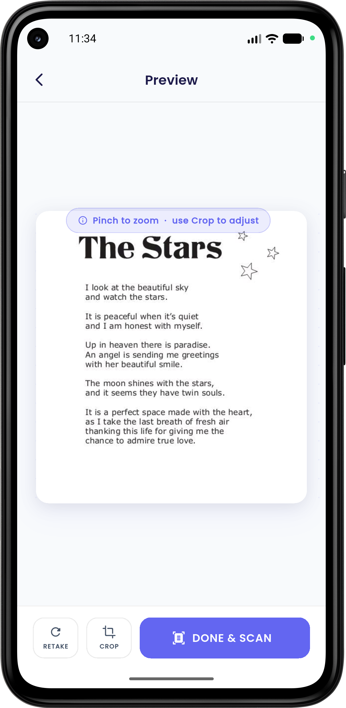
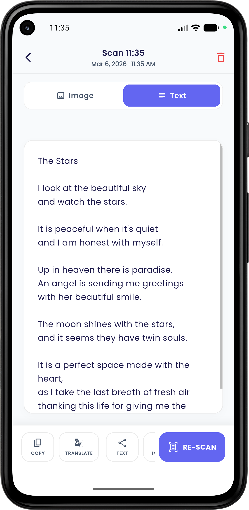
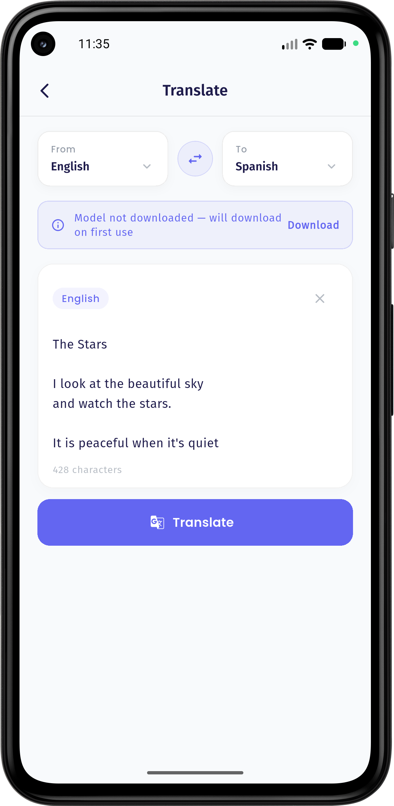
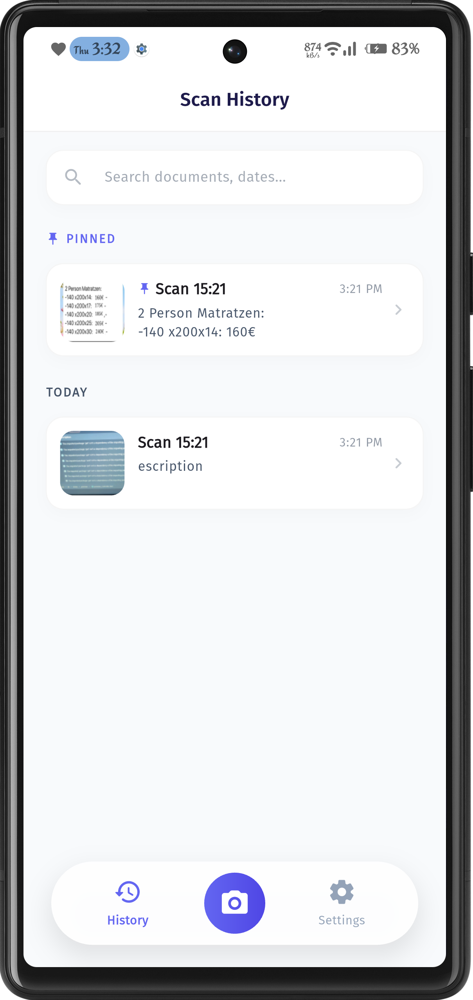
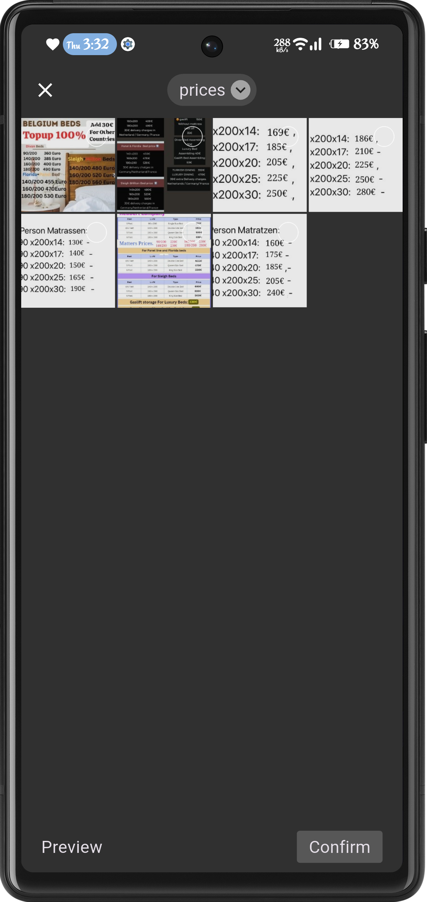
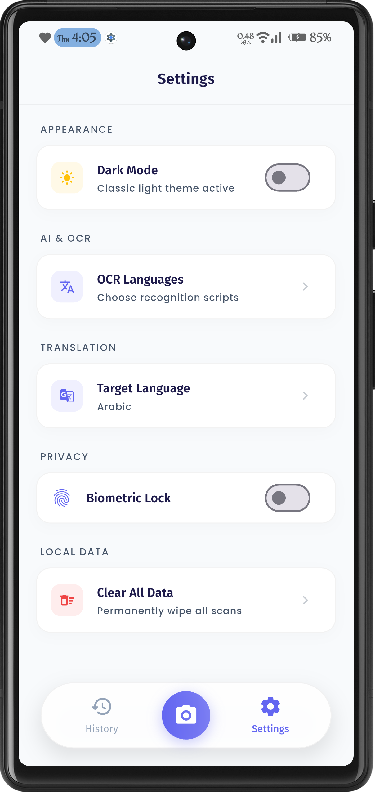

<p align="center">
  
</p>

<h1 align="center">SwiftScan</h1>

<p align="center">
  <strong>High-performance, 100% offline image scanning and text extraction.</strong>
</p>

---

**SwiftScan** is a professional, cross-platform image scanning application built with **Flutter**. It provides blazing-fast OCR (Optical Character Recognition) and real-time translations directly from images without requiring an internet connection, ensuring your data remains private and secure on your device.

---

## 📸 App Screenshots

| Scanner Preview | Scanning Process | Scan Preview |
| :---: | :---: | :---: |
|  |  |  |

| Scan Details | Translation | Scan History |
| :---: | :---: | :---: |
|  |  |  |

| Gallery Import | App Settings |
| :---: | :---: |
|  |  |

---

## ✨ Features

* **🛡️ 100% Offline Processing**: All text recognition and translations happen locally on your hardware. No images or text data are ever uploaded to any server.
* **Instant Image Scanning**: High-speed text extraction from live camera feeds or static images using local processing.
* **Multi-Language OCR**: Supports Latin, Chinese, Devanagari, Japanese, and Korean scripts for versatile text capture.
* **On-Device Translation**: Translate extracted text from images into multiple languages instantly without an internet connection.
* **Secure Local History**: Save and manage your scanned results locally using a persistent, private NoSQL database.
* **Biometric Security**: Protect your scanned image data with integrated FaceID or Fingerprint authentication.
* **Advanced Theme Engine**: Seamlessly switches between a clean Light Mode and a deep navy Dark Mode.
* **Gallery Integration**: Import existing images from your gallery for instant offline text processing.

---

## 🛠 Tech Stack

* **Framework**: [Flutter](https://flutter.dev/) (3.x) — High-performance cross-platform development.
* **Language**: [Dart](https://dart.dev/) — Optimized for fast apps on any platform.
* **State Management**: [GetX](https://pub.dev/packages/get) — Handles Dependency Injection, Routing, and Reactive State.
* **Local Database**: [Hive](https://pub.dev/packages/hive) — Blazing fast offline NoSQL database for image data persistence.
* **Processing Engine**: [Google ML Kit](https://developers.google.com/ml-kit) — Powers local Text Recognition and On-Device Translation.
* **Camera Implementation**: [Camerawesome](https://pub.dev/packages/camerawesome) — Advanced camera plugin for customized image capture.
* **Storage**: [GetStorage](https://pub.dev/packages/get_storage) — Fast key-value storage for local app preferences.

---

## 🏗 Project Architecture

The project follows a modular structure to ensure privacy-focused image handling and clean code:

* **Core**: Theme resources, constants, and global utility classes.
* **Data**: Managed by Repositories and Models using Hive for **local-only** data persistence.
* **Views**: Feature-based screens with separated widget components for a "Zero UI" logic in utilities.
* **Controllers**: Logic layers using GetX to manage state and interact with local repositories.


---

## 🚀 Getting Started

1.  **Clone the repository:**
    ```bash
    git clone [https://github.com/your-username/swiftscan.git](https://github.com/your-username/swiftscan.git)
    ```
2.  **Install dependencies:**
    ```bash
    flutter pub get
    ```
3.  **Run the application:**
    ```bash
    flutter run
    ```

---

*Developed with ❤️ as a secure, private image scanning solution.*
